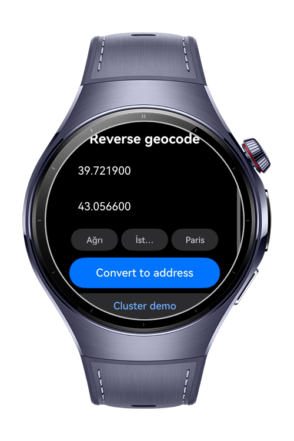
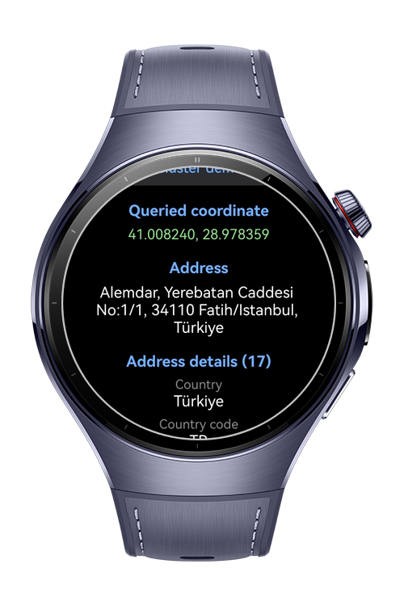
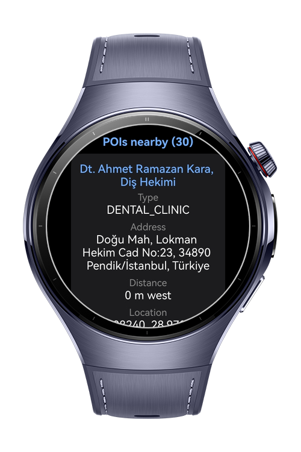
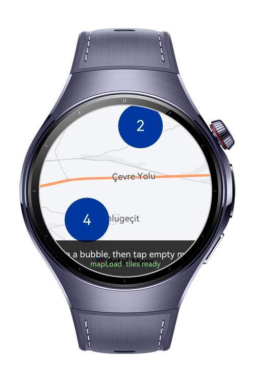

> **Note:** To access all shared projects, get information about environment setup, and view other guides, please visit [Explore-In-HMOS-Wearable Index](https://github.com/Explore-In-HMOS-Wearable/hmos-index).

# How to Convert Coordinates to Address with Map Kit and Handle Map Cluster Events
This sample (`how-to-convert-address-and-cluster`) demonstrates how to integrate **Map Kit** to convert a coordinate into a readable address (reverse geocoding) and how to handle map and cluster events on a wearable device.

# Preview
<div>
  
  
  
  
</div>

# Use Cases
- Show the address, nearby POIs and AOIs of a given latitude and longitude
- Group many markers into cluster bubbles and find out which places a tapped bubble contains
- Listen to map events (load, click, long click, POI click, marker click, camera move) alongside cluster events

# Tech Stack
- **Language:** ArkTS
- **Framework**: HarmonyOS SDK 6.0.0(20)
- **Tools** DevEco Studio 6.1.1 Release
- **Libraries**:
  - **Map Kit:** `site` used for `reverseGeocode` to convert coordinates to an address with POIs and AOIs.
  - **Map Kit:** `MapComponent`, `map` and `mapCommon` used to render the map, add the `ClusterOverlay` and listen to map and cluster events.
  - **Ability Kit:** `common` used to pass the `UIAbilityContext` to the reverse geocode request.
  - **Performance Analysis Kit:** `hilog` used to log the raw response and events.
  - **Basic Services Kit:** `BusinessError` used for typed error handling

# Directory Structure
```
entry/src/main/
├── ets/
│   ├── model/
│   │   └── ReverseGeocodeService.ets       # Reverse geocode request and result parsing
│   └── pages/
│       ├── Index.ets                       # Coordinate input and address result UI
│       └── ClusterPage.ets                 # Cluster overlay and map event handling
└── module.json5
```

# Constraints and Restrictions
## Supported Devices
- Huawei Watch 5

# LICENSE
**How to Convert Coordinates to Address with Map Kit and Handle Map Cluster Events** is distributed under the terms of the **MIT License**.
See the [LICENSE](/LICENSE) for more information.
